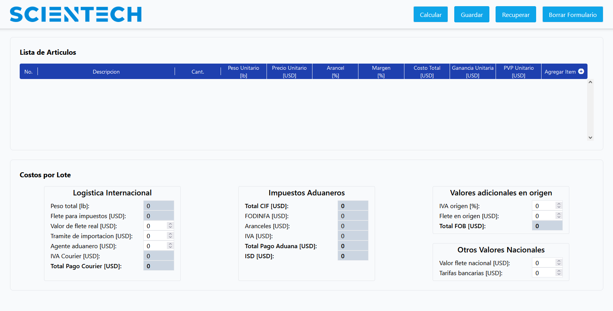

# Import Calculator - Scientech

This project is tailored based on the specific requirements of the end user (Scientech Ecuador)

### 🖥️ Desktop version

The aplication consist on a single page calculator with option to set and get data from local storage

<!-- Include some screenshots of desktop version -->

<!-- ### 📱 Mobile version -->

<!-- Include some screenshots of mobile version -->

<!-- ## ✅ Learning objectives

- objective 1
- objective 2
- objective 3 -->

## 🧩 Built With

- React.js
- Vite.js
- TailwindCSS

## 📚 Getting Started

To get a local copy up and running follow these simple example steps.

### Prerequisites

<!-- For this project to run you will need the following tools: -->

For this project to run you will not need aditional tools

### Setup

Fork a copy to your repository

### Install

Clone the repository in your local machine and run `npm i`

### Usage

From your prefered code editor run `npm run dev` to start working

## 💻📱 Live Preview

<!-- There is no Live Demo available at the moment -->

If you want to see a live demo of this project, [click here](https://williamrolando88.github.io/scientech-cost-calculator/)

## Authors

👤 **William Morales**

- GitHub: [@williamrolando88](https://github.com/williamrolando88)
- Twitter: [@WillyMorales93](https://twitter.com/WillyMorales93)
- LinkedIn: [William Morales](https://www.linkedin.com/in/william-rolando-morales/)

## 🤝 Contributing

Contributions, issues, and feature requests are welcome!

Feel free to check the [issues page](../../issues).

## 👏 Show your support

Give a ⭐️ if you like this project!

<!-- ## 👍 Credits -->

<!--
GUI & Graphic Design: Cindy Shin

- Behance: [Cindy Shin](https://www.behance.net/adagio07)
-->

## 📝 License

Copyright (c) 2022 William Morales

Permission is hereby granted, free of charge, to any person obtaining a copy of this software and associated documentation files (the "Software"), to deal in the Software without restriction, including without limitation the rights to use, copy, modify, merge, publish, distribute, sublicense, and/or sell copies of the Software, and to permit persons to whom the Software is furnished to do so, subject to the following conditions:

The above copyright notice and this permission notice shall be included in all copies or substantial portions of the Software.

THE SOFTWARE IS PROVIDED "AS IS", WITHOUT WARRANTY OF ANY KIND, EXPRESS OR IMPLIED, INCLUDING BUT NOT LIMITED TO THE WARRANTIES OF MERCHANTABILITY, FITNESS FOR A PARTICULAR PURPOSE AND NONINFRINGEMENT. IN NO EVENT SHALL THE AUTHORS OR COPYRIGHT HOLDERS BE LIABLE FOR ANY CLAIM, DAMAGES OR OTHER LIABILITY, WHETHER IN AN ACTION OF CONTRACT, TORT OR OTHERWISE, ARISING FROM, OUT OF OR IN CONNECTION WITH THE SOFTWARE OR THE USE OR OTHER DEALINGS IN THE SOFTWARE.
